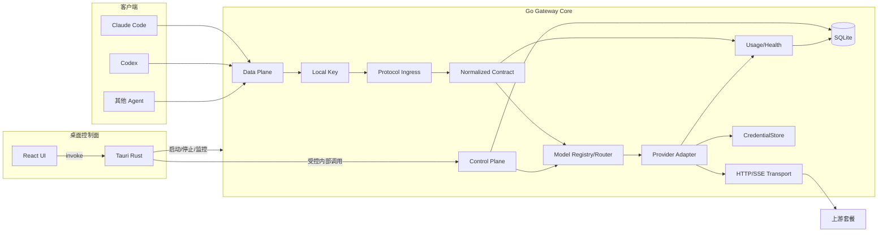
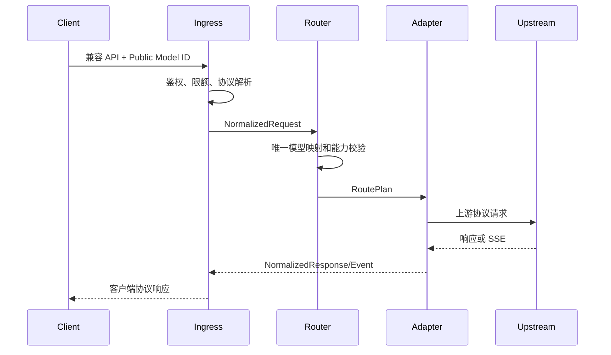

# Aggregation Hub 总体设计文档

> 文档编号：DESIGN-001  
> 状态：设计已批准，进入实施准备  
> 基线日期：2026-08-02

## 1. 项目摘要

Aggregation Hub 是一个 Windows 优先、可跨平台扩展的本地桌面 LLM 聚合网关。它把用户自己的官方 API、第三方兼容套餐、本地模型服务和经过验证的官方 OAuth 套餐接入一个本地 Data Plane。

Claude Code、Codex 和其他编程 Agent 只配置：

```text
Base URL: http://127.0.0.1:18443
API Key:  ah_local_...
Model:    provider-slug/upstream-model-id
```

所有已启用 Provider 同时在线，公开模型 ID 决定唯一上游；V1 不维护全局“当前 Provider”，不自动切换套餐。

## 2. 核心决策

| 主题 | 决策 |
|---|---|
| 运行方式 | 本机单用户桌面应用 |
| 平台 | Windows 优先，核心跨平台 |
| 实现 | 参考 New API 思路，独立实现，不复制 AGPL 源码 |
| 桌面 | Tauri 2 + React + TypeScript |
| 核心 | 独立 Go Sidecar |
| 数据 | SQLite + CredentialStore |
| 协议 | Anthropic Messages、OpenAI Responses、OpenAI Chat Completions |
| 模型 | `provider-slug/upstream-model-id` |
| 路由 | 确定性单 Provider 路由 |
| OAuth | 仅官方流程，不抓 Cookie/Session |
| 隐私 | 默认不持久化 Prompt、回复和 Tool 参数 |

## 3. 总体架构



Data Plane 提供：

```text
GET  /health
GET  /v1/models
POST /v1/messages
POST /v1/responses
POST /v1/chat/completions
```

除 `/health` 外全部需要 Local Access Key。React WebView 不直接访问 Control Plane、SQLite 或完整凭据。

## 4. 请求链路



约束：

- Ingress 不识别具体 Provider；
- Adapter 不选择路由；
- 不支持能力必须提前拒绝；
- 流式开始后不重试、不换 Provider；
- 客户端断开必须取消上游；
- Usage 未知时保持未知，不能伪造零值。

## 5. 功能范围

V1 包括：桌面生命周期、Provider CRUD、模型同步与手工配置、三种兼容入口、SSE、Tool Calling、Reasoning/Thinking、请求取消、用量统计、诊断、Claude Code/Codex 配置生成，以及至少一个经过真实验证的官方 OAuth Adapter。

V1 不包括：多用户、支付、公网、局域网、智能路由、跨 Provider 自动故障转移、云同步、动态插件、完整请求正文和多媒体 API。

## 6. 数据与安全摘要

主要实体包括 Provider、模型、价格历史、OAuth 账户、本地访问密钥、健康检查、请求元数据、日用量和审计事件。

- 上游秘密进入 Windows 系统凭据库，SQLite 只保存引用；
- Local Access Key 只保存哈希，完整值仅创建时展示一次；
- Data Plane 固定回环监听；
- 管理令牌每次启动生成，通过 stdin 传给 Core；
- TLS 验证不可关闭；
- Public/Local Provider 使用不同出站网络策略；
- 日志和诊断包使用字段白名单与统一脱敏。

## 7. 发布证据等级

- L1：单元/Fake 测试；
- L2：Core + Fake 上游；
- L3：真实 Provider；
- L4：真实 Claude Code/Codex；
- L5：真实 OAuth + 客户端 + Tool Calling。

V1 必须达到 Claude Code L4、Codex L4，以及至少一个 OAuth L5，或提交经过复核的不可行限制报告。

## 8. 专项文档

- [产品需求](./01-product-requirements.md)
- [功能设计](./02-functional-design.md)
- [系统架构](./03-system-architecture.md)
- [API 设计](./04-api-design.md)
- [数据库设计](./05-database-design.md)
- [Adapter 设计](./06-provider-adapter-design.md)
- [前端设计](./07-frontend-design.md)
- [安全设计](./08-security-design.md)
- [测试策略](./09-testing-strategy.md)
- [追踪矩阵](./10-requirements-traceability.md)
- [路线图](./11-roadmap.md)
- [开源与发布](./12-open-source-and-release.md)
- [V1 总实施计划](./13-implementation-plan.md)
- [Phase 实施计划](./implementation/)
- [AI 开发上下文](./ai/AI_CONTEXT.md)

## 9. 下一步

设计评审与实施计划已经完成。下一步从 `docs/implementation/00-foundation.md` 开始建立工具链、Workspace、Go Core 和 Tauri Desktop 骨架；每个阶段必须通过对应 Gate 后再进入下一阶段。
