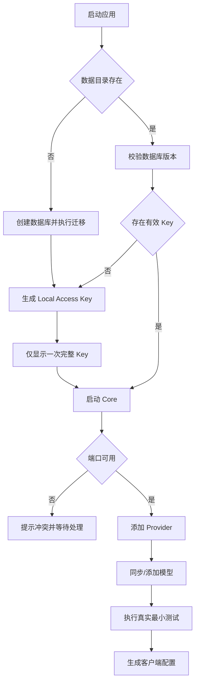

# Aggregation Hub 功能设计

> 文档编号：FD-001  
> 状态：设计评审中

## 1. 功能域

系统分为八个功能域：桌面生命周期、Provider 与凭据、模型目录、Data Plane、OAuth、可观测性、客户端接入、设置与诊断。UI 只调用控制面用例，不直接访问 SQLite 或上游。

## 2. 首次启动

完整 Key 关闭后无法从哈希恢复；遗失只能轮换。

## 3. Core 生命周期

状态：`stopped -> starting -> running/degraded/failed -> stopping -> stopped`。

- 异常退出按 1、3、10 秒退避重启；十分钟内三次失败后停止自动重启。
- 用户主动退出不触发重启。
- 关闭窗口默认隐藏到托盘；“退出”才停止 Core。
- 停止时先拒绝新请求，再给运行中请求一个可配置的优雅终止窗口。
- 默认端口冲突时不静默换端口，避免客户端配置失效。

## 4. Provider 管理

创建向导：

1. 选择 OpenAI Compatible、Anthropic Compatible、OAuth 或 Local；
2. 输入名称、slug、Base URL；
3. 输入凭据和可选 Header；
4. 配置超时；
5. 测试 DNS/TLS/认证；
6. 同步或手工添加模型；
7. 确认公开模型 ID 后保存。

Provider 状态：

| 状态 | 含义 | 模型可见 |
|---|---|---:|
| `draft` | 配置未完成 | 否 |
| `enabled` | 可正常调用 | 是 |
| `degraded` | 部分能力异常 | 是，带警告 |
| `auth_required` | 凭据缺失或过期 | 否 |
| `disabled` | 用户禁用 | 否 |
| `deleted` | 软删除 | 否 |

修改 Base URL 或认证后旧健康状态失效。Adapter 类型和 slug 不允许原地改变，必须克隆 Provider，避免模型 ID 静默变化。

Provider/模型可路由状态、软删除后的 slug 策略、凭据替换/删除的补偿顺序及 Task 1.4 的 OAuth 边界由 ADR-0006 固化。

## 5. 模型管理

模型来源包括上游列表、Adapter 默认、OAuth 结果和手工录入。同步规则：

- 新模型默认禁用，由用户选择启用；
- 上游消失的模型标记 `missing_upstream`，不自动删除；
- 用户能力覆盖不被同步覆盖；
- 每个模型声明 Stream、Tools、Parallel Tools、Reasoning、Thinking、Vision、上下文和最大输出；
- 公开 ID 为 `provider-slug/upstream-model-id`。

路由步骤：校验 ID -> 查模型 -> 查 Provider -> 校验能力 -> 还原上游模型 -> 选 Adapter -> 调用。V1 路由结果最多一个。

## 6. 请求处理

### 非流式

鉴权和解析后生成 `NormalizedRequest`，Router 产生 `RoutePlan`，Adapter 调用上游并返回 `NormalizedResponse`，最后由入口协议序列化。

### 流式

- 上游首事件到达后立即输出；
- 使用有界缓冲和背压；
- 客户端断开时取消 Context 并关闭上游 Body；
- 发送任何正文后不得重试；
- 一个流只能有一个终态；
- Usage 缺失时记录未知，不能伪造。

### 不兼容能力

如果模型不支持工具或 Reasoning，必须返回 `unsupported_feature`，不得删除字段后继续普通请求。

## 7. OAuth

状态：`disconnected -> authorizing -> connected -> refreshing -> connected/auth_required -> revoked`。

- 使用系统浏览器、PKCE、state 和短时回环回调；
- Token 交换和刷新只在 Core 中进行；
- WebView 不接触 Token；
- 不读取 Cookie、Session 或账号密码；
- “官方客户端可登录”不自动等于“第三方网关可代理”，每个 Adapter 单独证明；
- 未达到真实证据的 Adapter 标记 experimental，默认关闭。

## 8. 请求日志和用量

请求状态：`pending`、`streaming`、`succeeded`、`failed`、`cancelled`、`aborted_by_restart`。启动时把遗留 `pending/streaming` 更新为 `aborted_by_restart`。

记录 Provider、模型、协议、状态、时延、首 Token、Token 分类和估算费用；不保存 Prompt、回复、Tool 参数、Header 和完整上游错误体。

默认保留：请求明细 30 天、健康明细 7 天、文本日志 14 天、日汇总长期保留。清理前先汇总，按批次删除。

## 9. 客户端接入

Claude Code 页面生成 Base URL、Key 环境变量占位符、模型 ID 和 Messages/Tool 测试。Codex 页面生成自定义 Model Provider、Responses wire API、认证环境变量和模型配置。

已有 Local Key 只保存哈希，无法再次显示完整值。用户可复制带占位符模板，或创建新 Key 并在当前页面一次性复制完整配置。V1 不自动修改第三方配置文件。

## 10. 设置与诊断

设置：网关端口、超时、开机启动、数据保留、日志级别、主题、语言和更新策略。

诊断：版本、数据库迁移、CredentialStore、监听地址、Provider 健康、最近脱敏错误、打开数据目录和导出诊断包。诊断包不含数据库、凭据、请求正文和用户目录绝对路径。
