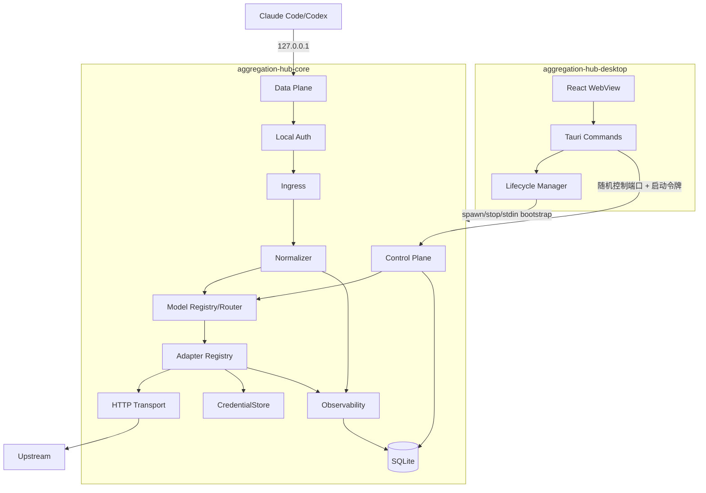
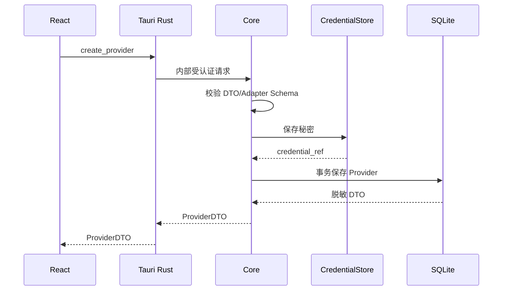

# Aggregation Hub 系统架构设计

> 文档编号：ARCH-001  
> 状态：设计评审中

## 1. 架构原则

1. Data Plane 与 Control Plane 分离。
2. 入口协议与上游协议通过规范化模型解耦。
3. Provider 差异只存在于 Adapter。
4. Core 可脱离 UI 独立测试。
5. 不支持能力默认拒绝，不静默降级。
6. 取消、SSE 和 Tool Calling 是一等能力。
7. WebView、日志和业务表最小接触秘密。
8. 独立实现，不复制 AGPL 项目源码。

## 2. 技术基线

| 层 | 选型 | 原因 |
|---|---|---|
| 桌面 | Tauri 2 | 托盘、跨平台、能力权限边界 |
| 前端 | React + TypeScript + Vite | 强类型管理型 UI |
| Core | Go 独立进程 | HTTP/SSE、Context 取消、单文件分发 |
| 数据库 | SQLite | 本地单用户、事务可靠、部署简单 |
| 控制通信 | Tauri Command + Rust + 内部回环 API | WebView 不持有管理令牌 |
| 凭据 | CredentialStore | Windows 系统凭据库默认、测试内存实现 |

精确版本在实施计划开始时根据当前稳定版锁定。

## 3. 进程架构



## 4. 进程职责

### Desktop

负责窗口、托盘、开机启动、更新、Core 生命周期、端口检查、配置展示和诊断。它不代理模型请求、不连上游、不解析 SSE、不直接读 SQLite、不保存 Token。

### Core

负责 Data/Control Plane、本地鉴权、Provider/模型、协议转换、上游连接、OAuth 刷新、SQLite、脱敏日志和用量。测试时可使用临时目录、随机端口和 MemoryCredentialStore 独立启动。

## 5. 端口与控制通道

- Data Plane 默认 `127.0.0.1:18443`，V1 不允许绑定 `0.0.0.0` 或局域网 IP。
- Control Plane 每次启动绑定随机回环端口。
- Lifecycle Manager 生成高熵管理令牌，经 stdin 传给 Core；禁止命令行和 URL 传递。
- React 不读取管理令牌，只通过 Tauri Commands 操作。
- Control Plane 不启用 CORS，不接受浏览器直接调用。

## 6. Core 模块

### bootstrap

初始化脱敏日志、数据目录、迁移、CredentialStore、两个 Plane，并输出机器可解析的 ready 事件。

### ingress

按 `openai_chat`、`openai_responses`、`anthropic_messages`、`models`、`health` 拆分。只负责入口鉴权后的大小限制、解析、规范化和出口序列化，不选 Provider。

### normalizer

内部请求包含：RequestID、SourceProtocol、PublicModelID、System、Messages、Tools、ToolChoice、Reasoning、Stream、Token/温度/Stop 和受限 Metadata。

内容使用显式联合类型：text、image、reasoning、tool_call、tool_result。禁止以 `map[string]any` 作为主业务模型。

### model_registry/router

根据 Public Model ID 唯一查询 Provider 和上游模型，校验模型能力后生成不可变 `RoutePlan`。V1 没有权重、候选池和跨 Provider 重试。

### adapter_registry

按 adapter type 注册工厂，验证 Provider 配置 Schema。V1 只允许编译期 Adapter，不动态加载任意库。

### transport

复用 HTTP Transport；分别控制建连、首字节、空闲和请求超时；校验 TLS；限制重定向、Header、Body 和 SSE Event；客户端取消时关闭上游 Body；日志不打印 Header/Body。

### observability/storage

请求元数据通过有界队列写 SQLite；队列拥塞时保留终态和错误，允许丢弃低价值调试事件并记录计数。Repository 使用参数化 SQL和显式事务。

### credential_store

接口提供 Put/Get/Delete/Probe。V1 实现 WindowsCredentialStore 和测试用 MemoryCredentialStore；便携明文模式不进入 V1。

## 7. 控制面创建 Provider



CredentialStore 成功而数据库失败时必须补偿删除新凭据；补偿失败记录不含秘密的孤儿引用事件。

## 8. 目标目录

```text
apps/
  desktop/
    src/
    src-tauri/
  core/
    cmd/aggregation-hub-core/
    internal/
      bootstrap/ controlplane/ dataplane/ ingress/
      normalize/ routing/ provider/ adapter/
      transport/ credential/ storage/ observability/ security/
    migrations/
    testdata/
packages/
  protocol-fixtures/
  shared-contracts/
docs/
```

Control Plane DTO 以 OpenAPI/JSON Schema 为事实来源生成或校验，避免 Go、Rust、TypeScript 三边漂移。

## 9. 故障模型

| 故障 | 行为 |
|---|---|
| Core 启动失败 | Desktop 显示结构化错误，不进入 running |
| 迁移失败 | 停止启动，保留数据库和备份 |
| CredentialStore 异常 | Provider 进入 `auth_required` |
| 单 Provider 失败 | 只影响该 Provider，不切换渠道 |
| WebView 崩溃 | Core 继续运行，窗口可重建 |
| 桌面退出 | V1 默认停止 Core |
| 上游断流 | 记录截断，不重放请求 |

## 10. 强制边界

- Core 不依赖 Tauri/React。
- UI 不依赖数据库表。
- Adapter 不写数据库和请求日志。
- Router 不读取完整凭据。
- Transport 不理解 OpenAI/Anthropic DTO。
- Control Plane 不返回完整凭据。
- 一个请求只由一个 Adapter 承担。