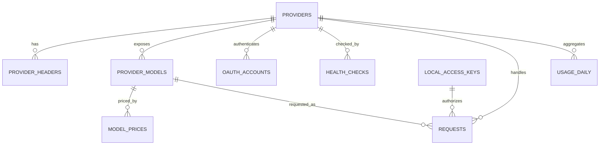

# Aggregation Hub 数据库设计

> 文档编号：DB-001  
> 状态：设计评审中  
> 数据库：SQLite

## 1. 目标与约定

数据库支持本地单用户长期运行，不保存 Prompt、回复、Tool 参数和完整上游凭据。Provider 软删除后保留历史统计；金额使用整数微美元；所有列表和时间查询建立索引。

Windows 数据目录：

```text
%LOCALAPPDATA%\AggregationHub\
  aggregation-hub.db
  backups\
  logs\
  diagnostics\
```

每个连接启用：

```sql
PRAGMA foreign_keys = ON;
PRAGMA journal_mode = WAL;
PRAGMA synchronous = NORMAL;
PRAGMA busy_timeout = 5000;
```

主键使用 TEXT ULID；时间使用 UTC Unix 毫秒；布尔使用 0/1；JSON 写入前通过 Schema；金额使用 INTEGER 微美元。

## 2. 实体关系



## 3. 核心表

### schema_migrations

字段：version、name、checksum、applied_at。迁移命名 `0001_initial.sql`。已执行迁移不得修改；修复必须新增迁移。

### app_settings

字段：key、value_json、updated_at。只允许受控 key，如端口、保留期、主题、语言和开机启动；禁止保存秘密。

### local_access_keys

字段：id、name、token_hash、token_prefix、token_suffix、status、created_at、last_used_at、expires_at、revoked_at。

- 完整 Key 不持久化；
- token_hash 唯一；
- 状态为 active/revoked/expired；
- 因 Token 高熵，可使用 SHA-256 并固定时序比较。

### providers

字段：id、slug、name、adapter_type、auth_type、base_url、credential_ref、lifecycle_status、enabled、timeout_ms、adapter_config_json、version、created_at、updated_at、deleted_at。

约束：

- slug 小写、1~48 字符、全局唯一；
- auth_type 为 api_key/bearer_token/oauth/none；
- 有认证时 credential_ref 必填；
- 状态为 draft/enabled/degraded/auth_required/disabled/deleted；
- adapter_config_json 不保存秘密。

索引：enabled+status、adapter_type。

### provider_headers

字段：id、provider_id、name、value_plaintext、credential_ref、is_secret、created_at、updated_at。

普通 Header 存 value；秘密 Header 只存 credential_ref。authorization、host、content-length 等受保护头不得保存。provider_id+name 唯一。

### provider_models

字段：id、provider_id、upstream_model_id、public_model_id、display_name、source、lifecycle_status、enabled、各能力布尔、context_window_tokens、max_output_tokens、capability_source、capability_override_json、version 和时间字段。

约束：public_model_id 全局唯一；provider_id+upstream_model_id 唯一；应用保证公开 ID 前缀等于 Provider slug。

### model_prices

字段：id、provider_model_id、currency、输入/输出/缓存/Reasoning 每百万 Token 微美元价格、source、effective_from、effective_to、created_at。

价格变化新增历史记录，不覆盖旧记录；未知价格保持 NULL。

### oauth_accounts

字段：id、provider_id、account_label、subject_hash、credential_ref、scopes_json、status、expires_at、last_refreshed_at、last_error_code 和时间字段。

Access Token、Refresh Token、PKCE verifier、client secret 不进入 SQLite。

### provider_health_checks

字段：id、provider_id、provider_model_id、check_type、status、latency_ms、error_code、checked_at。不保存响应正文。

### requests

字段：

- id、client_request_id；
- local_access_key_id、provider_id、provider_model_id、model_price_id；
- Provider/模型快照；
- source_protocol、endpoint、streaming、status、http_status、error_code、retryable；
- usage_source 和 Token 分类；
- estimated_cost_microusd；
- request_bytes、response_bytes、duration_ms、first_token_ms；
- created_at、started_stream_at、completed_at。

状态为 pending/streaming/succeeded/failed/cancelled/aborted_by_restart。此表没有请求正文、Header、完整 URL 和上游原始错误体。

索引：created_at、provider+time、model+time、status+time、protocol+time。

### usage_daily

主键由 UTC 日期、Provider 快照、Public Model 快照组成。保存请求/成功/失败/取消数、Token 分类和费用。请求明细清理前先幂等汇总。

### audit_events

记录凭据替换、密钥创建/撤销、OAuth 连接/撤销、Provider 删除、数据清理和诊断导出。detail_json 使用字段白名单。

## 4. 事务边界

创建 Provider：先写新 CredentialStore 引用，再在 SQLite 事务中写 Provider/Header/模型；数据库失败时补偿删除凭据。

替换凭据：先写新引用 -> 提交数据库 -> 删除旧引用，确保中途失败仍可使用旧凭据。

请求：接收时插入 pending；流式开始更新 streaming；终态事务更新请求并 UPSERT 日汇总。启动时把遗留 pending/streaming 更新为 aborted_by_restart。

### 4.1 Provider 生命周期与凭据补偿

Provider/模型的可路由条件、OAuth 的阶段边界、slug 复用、CredentialStore 清理顺序与同步模型保留规则见 ADR-0006。Provider 删除或替换凭据后的 CredentialStore 清理失败不得回滚已提交的 SQLite 状态；必须写入不含秘密的清理失败审计事件。

## 5. 迁移

1. 检查迁移版本和校验和；
2. checkpoint WAL；
3. 创建带时间戳备份；
4. 在事务中执行迁移；
5. 失败立即停止启动并保留原库和备份；
6. 不自动 reset；
7. V1 只接受前向迁移。

删除字段采用两阶段：先停止写入并兼容读取，后续版本再删除。

## 6. 保留、备份与恢复

默认请求明细 30 天、健康明细 7 天、审计敏感动作至少 180 天、日汇总长期保留。清理分批执行，避免长时间锁表。

自动备份只包含 SQLite，不包含 CredentialStore。恢复前停止 Core 并备份当前库；跨机器恢复后 Provider 进入 auth_required，需要重新录入凭据。

## 7. Repository 规则

- 只使用参数化 SQL；
- UI 不知道表结构；
- 列表必须分页，排序字段 allowlist；
- JSON 解析失败视为数据损坏，不静默用空对象；
- 写用例显式声明事务；
- 测试使用真实临时 SQLite 文件并启用外键。
## 8. V1 逻辑 DDL 基线

以下 DDL 用于锁定字段类型和关键约束；实施迁移可按数据库驱动细化，但不得改变语义。

```sql
CREATE TABLE schema_migrations (
  version INTEGER PRIMARY KEY,
  name TEXT NOT NULL,
  checksum TEXT NOT NULL,
  applied_at INTEGER NOT NULL
);

CREATE TABLE local_access_keys (
  id TEXT PRIMARY KEY,
  name TEXT NOT NULL,
  token_hash BLOB NOT NULL UNIQUE,
  token_prefix TEXT NOT NULL,
  token_suffix TEXT NOT NULL,
  status TEXT NOT NULL CHECK (status IN ('active','revoked','expired')),
  created_at INTEGER NOT NULL,
  last_used_at INTEGER,
  expires_at INTEGER,
  revoked_at INTEGER
);

CREATE TABLE providers (
  id TEXT PRIMARY KEY,
  slug TEXT NOT NULL UNIQUE,
  name TEXT NOT NULL,
  adapter_type TEXT NOT NULL,
  auth_type TEXT NOT NULL CHECK (auth_type IN ('api_key','bearer_token','oauth','none')),
  base_url TEXT NOT NULL,
  credential_ref TEXT,
  lifecycle_status TEXT NOT NULL CHECK (
    lifecycle_status IN ('draft','enabled','degraded','auth_required','disabled','deleted')
  ),
  enabled INTEGER NOT NULL CHECK (enabled IN (0,1)),
  timeout_ms INTEGER NOT NULL CHECK (timeout_ms BETWEEN 1000 AND 3600000),
  adapter_config_json TEXT NOT NULL DEFAULT '{}',
  version INTEGER NOT NULL DEFAULT 1,
  created_at INTEGER NOT NULL,
  updated_at INTEGER NOT NULL,
  deleted_at INTEGER,
  CHECK (slug = lower(slug)),
  CHECK (length(slug) BETWEEN 1 AND 48),
  CHECK ((auth_type='none' AND credential_ref IS NULL) OR
         (auth_type<>'none' AND credential_ref IS NOT NULL))
);

CREATE TABLE provider_models (
  id TEXT PRIMARY KEY,
  provider_id TEXT NOT NULL REFERENCES providers(id),
  upstream_model_id TEXT NOT NULL,
  public_model_id TEXT NOT NULL UNIQUE,
  display_name TEXT NOT NULL,
  source TEXT NOT NULL CHECK (source IN ('upstream','adapter_default','manual','oauth')),
  lifecycle_status TEXT NOT NULL CHECK (
    lifecycle_status IN ('available','degraded','missing_upstream','disabled','deleted')
  ),
  enabled INTEGER NOT NULL CHECK (enabled IN (0,1)),
  supports_streaming INTEGER NOT NULL CHECK (supports_streaming IN (0,1)),
  supports_tools INTEGER NOT NULL CHECK (supports_tools IN (0,1)),
  supports_parallel_tools INTEGER NOT NULL CHECK (supports_parallel_tools IN (0,1)),
  supports_reasoning INTEGER NOT NULL CHECK (supports_reasoning IN (0,1)),
  supports_thinking INTEGER NOT NULL CHECK (supports_thinking IN (0,1)),
  supports_vision INTEGER NOT NULL CHECK (supports_vision IN (0,1)),
  context_window_tokens INTEGER,
  max_output_tokens INTEGER,
  capability_source TEXT NOT NULL,
  capability_override_json TEXT NOT NULL DEFAULT '{}',
  version INTEGER NOT NULL DEFAULT 1,
  created_at INTEGER NOT NULL,
  updated_at INTEGER NOT NULL,
  deleted_at INTEGER,
  UNIQUE(provider_id, upstream_model_id)
);

CREATE TABLE oauth_accounts (
  id TEXT PRIMARY KEY,
  provider_id TEXT NOT NULL REFERENCES providers(id),
  account_label TEXT NOT NULL,
  subject_hash TEXT,
  credential_ref TEXT NOT NULL,
  scopes_json TEXT NOT NULL DEFAULT '[]',
  status TEXT NOT NULL CHECK (status IN ('connected','refreshing','auth_required','revoked')),
  expires_at INTEGER,
  last_refreshed_at INTEGER,
  last_error_code TEXT,
  created_at INTEGER NOT NULL,
  updated_at INTEGER NOT NULL
);

CREATE TABLE requests (
  id TEXT PRIMARY KEY,
  client_request_id TEXT,
  local_access_key_id TEXT REFERENCES local_access_keys(id),
  provider_id TEXT REFERENCES providers(id),
  provider_model_id TEXT REFERENCES provider_models(id),
  provider_slug_snapshot TEXT NOT NULL,
  public_model_snapshot TEXT NOT NULL,
  upstream_model_snapshot TEXT NOT NULL,
  source_protocol TEXT NOT NULL CHECK (
    source_protocol IN ('anthropic_messages','openai_responses','openai_chat')
  ),
  endpoint TEXT NOT NULL,
  streaming INTEGER NOT NULL CHECK (streaming IN (0,1)),
  status TEXT NOT NULL CHECK (
    status IN ('pending','streaming','succeeded','failed','cancelled','aborted_by_restart')
  ),
  http_status INTEGER,
  error_code TEXT,
  usage_source TEXT CHECK (usage_source IN ('upstream_reported','locally_estimated','unknown')),
  input_tokens INTEGER,
  output_tokens INTEGER,
  cached_input_tokens INTEGER,
  cache_write_tokens INTEGER,
  reasoning_tokens INTEGER,
  estimated_cost_microusd INTEGER,
  duration_ms INTEGER,
  first_token_ms INTEGER,
  created_at INTEGER NOT NULL,
  started_stream_at INTEGER,
  completed_at INTEGER
);

CREATE INDEX idx_providers_enabled_status ON providers(enabled, lifecycle_status);
CREATE INDEX idx_models_provider_enabled ON provider_models(provider_id, enabled, lifecycle_status);
CREATE INDEX idx_requests_created ON requests(created_at DESC);
CREATE INDEX idx_requests_provider_created ON requests(provider_id, created_at DESC);
CREATE INDEX idx_requests_status_created ON requests(status, created_at DESC);
```

`provider_headers`、`model_prices`、`provider_health_checks`、`usage_daily` 和 `audit_events` 按前文语义建立迁移，并在实施计划中给出完整 SQL 与 Repository 测试。
