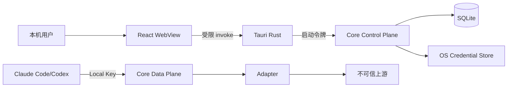

# Aggregation Hub 安全设计

> 文档编号：SEC-001  
> 状态：设计评审中

## 1. 安全目标

1. API Key、OAuth Token 和 Local Key 不进入日志、URL、UI Store 和诊断包。
2. Data Plane 默认只允许本机客户端访问。
3. WebView 被攻破时不能直接读取凭据、数据库或管理令牌。
4. 用户 Base URL 不得导致危险协议、元数据访问或认证头泄露。
5. 上游响应视为不可信，不能直接渲染 HTML 或无限占用内存。
6. 迁移和更新失败不损坏用户数据。
7. 不宣称能抵御已经完全控制当前用户会话的恶意软件。

## 2. 资产与信任边界

高敏感资产：上游 API Key、OAuth Refresh Token、Local Key、数据库和更新产物。Prompt、回复和 Tool 参数在 V1 默认不持久化。

WebView 是低信任 UI；本机客户端并非默认可信；上游、DNS、TLS、SSE、错误 Body 和 SQLite JSON 都按不可信输入处理。

## 3. 主要威胁与控制

### 本地未授权调用

- 固定 `127.0.0.1`；
- 除 `/health` 外必须 Local Key；
- 不启用宽松 CORS；
- 全局和 Provider 并发上限；
- Key 可立即撤销和轮换；
- 记录 Key ID，不记录完整值。

### WebView/XSS

- Tauri capability allowlist；
- WebView 不持有管理令牌；
- 只暴露显式 Commands，Rust 再校验参数；
- 禁止任意 Shell、任意路径和任意 URL 打开；
- CSP 禁止远程脚本；
- 不使用 `dangerouslySetInnerHTML`；
- UI 资源随应用打包，不加载远程后台。

### 凭据泄露

- Provider 只保存 credential_ref；
- Windows 默认系统凭据库；
- 管理令牌经 stdin 传递；
- Local Key 只保存哈希；
- 日志字段级脱敏，最终 Sink 再扫描兜底；
- 不记录 Header/Body；
- 前端不把秘密放 URL、localStorage、sessionStorage 或全局 Store；
- 诊断导出使用文件 allowlist。

系统凭据库降低数据库、备份和误共享风险，但不能防御已经控制当前用户进程的恶意软件。

### SSRF 与 Base URL

- 只允许 HTTP/HTTPS；
- 拒绝 URL 用户名、密码和 fragment；
- Public Provider 默认要求 HTTPS，并拒绝回环、私有和链路本地地址；
- Local Provider 可访问用户确认的回环/私有地址；
- 永久阻止云元数据地址；
- DNS 解析和重定向后重新校验；
- 跨主机重定向不携带认证头；
- 禁止 file、gopher、ftp 等协议。

### TLS

V1 不提供“忽略证书错误”和全局自定义 CA。证书失败显示可操作错误，不自动降级 HTTP。未来自定义 CA 需独立设计，不能关闭全局验证。

### 上游响应攻击

限制响应 Header、非流式 Body、SSE 单事件、未完成缓冲、JSON 深度、字符串长度和 Tool Schema。错误正文截断、转义、脱敏；UI 只显示纯文本安全摘要；不执行上游代码、HTML 和链接。

### OAuth

- 系统浏览器、Authorization Code + PKCE、随机 state；
- 回调监听随机回环端口并短时过期；
- 会话只能消费一次；
- verifier 仅内存；
- Token 直接进入 CredentialStore；
- 刷新 singleflight；
- 撤销后删除引用并写审计；
- 不记录授权 URL 查询参数和回调参数。

### 费用和资源滥用

设置全局/Provider 并发、请求体限制、建连/首字节/空闲/总超时和可取消运行请求。V1 不自动换 Provider；短暂熔断只保护本地资源。

### 数据库和更新

迁移前 WAL checkpoint 与备份；迁移带版本和校验和；失败停止启动，不 reset。依赖锁定并扫描；发布生成 SBOM、SHA-256 和签名；更新失败保留旧版本；V1 不动态下载执行社区 Adapter。

## 4. 凭据生命周期

创建/替换时 UI 只提交一次秘密，响应只返回 configured 和掩码。替换采用“写新引用 -> 提交数据库 -> 删除旧引用”。删除失败的孤儿引用通过审计记录清理。

不提供导出完整上游凭据；数据库备份不含秘密，跨机器恢复需重新配置。

## 5. 日志规则

允许：request_id、provider/model ID、状态、错误 code、时延、Token、版本和受控 URL 主机。

禁止：Authorization、x-api-key、Cookie、OAuth code/state/verifier/Token、Prompt、回复、Tool 参数、完整 Body、带 Query 授权 URL、用户目录绝对路径和数据库转储。

测试向所有入口注入哨兵秘密，并扫描应用日志、SQLite、诊断包和崩溃输出。

## 6. 安全默认值

| 配置 | 默认 |
|---|---|
| 监听 | `127.0.0.1` 且 V1 不可改 host |
| Local Key | 必需 |
| TLS | 开启且不可关闭 |
| Prompt/回复持久化 | 关闭，V1 无开启选项 |
| 完整 HTTP 日志 | 关闭 |
| 开机启动 | 关闭 |
| 实验 OAuth | 关闭 |
| 动态插件 | 禁止 |
| 自动改第三方配置 | 禁止 |

## 7. 安全验证

必须包含：未认证/冲突头、CORS、SSRF、DNS 变化、Redirect 认证头、超大 Header/Body/SSE、Tool Schema 深度、OAuth CSRF/重放/超时、日志秘密扫描、迁移故障、更新签名、Tauri capability 和依赖许可证测试。

## 8. 安全事件响应

发现泄露时停止 Provider，撤销并轮换上游凭据和 Local Key，保留脱敏版本证据，不把含秘密日志提交 Issue。发布前创建根目录 `SECURITY.md`，提供私密报告渠道和支持版本。