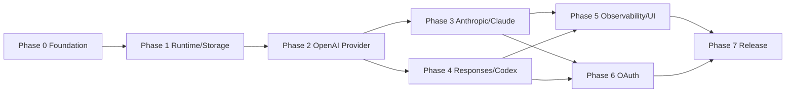

# Aggregation Hub V1 Implementation Plan

> **For agentic workers:** REQUIRED SUB-SKILL: Use superpowers:subagent-driven-development (recommended) or superpowers:executing-plans to implement this plan task-by-task. Steps use checkbox (`- [ ]`) syntax for tracking.

**Goal:** 构建一个 Windows 优先的本地桌面 LLM 聚合网关，使 Claude Code、Codex 和兼容 Agent 通过一个固定 Base URL、Local Access Key 和命名空间模型目录访问多个用户自有套餐。

**Architecture:** Tauri 2 + React/TypeScript 提供桌面控制面，独立 Go Sidecar 提供 Data Plane、Control Plane、Provider Adapter、SQLite 和 CredentialStore。入口协议全部转换为 Normalized Contract，再确定性路由到一个 Provider Adapter；WebView 不直接接触数据库、管理令牌和完整凭据。

**Tech Stack:** Windows 10/11 x64；Node.js 24.13.0；pnpm 11.18.0；Go 1.26.5；Rust stable（Phase 0 安装后锁定精确版本）；Tauri CLI 2.11.4/API 2.11.1；React 19.2.8；TypeScript 5.9.3；Vite 8.2.0；Vitest 4.1.10；SQLite/modernc.org/sqlite v1.54.0。

## Global Constraints

- Data Plane V1 只能监听 `127.0.0.1`，不得加入 `0.0.0.0` 或局域网模式。
- 除 `/health` 外所有 Data Plane 请求必须校验 Local Access Key。
- Public Model ID 固定为 `provider-slug/upstream-model-id`，V1 确定性单 Provider 路由。
- 不支持的 System、Tool、Reasoning、Thinking 等语义必须明确拒绝，不能静默丢弃。
- 默认不保存 Prompt、回复、Tool 参数、请求 Header、完整 URL Query 和上游完整错误体。
- 上游秘密通过 CredentialStore；SQLite 只保存引用；Local Access Key 只保存哈希。
- OAuth 仅允许官方授权流程，不读取 Cookie、网页 Session 和账号密码。
- 客户端取消必须传播到上游；流式开始后不得重试或切换 Provider。
- 新 Provider 只能通过 Adapter 扩展，不得在 Router 或 Ingress 增加供应商分支。
- 代码注释使用中文，解释原因、约束和安全边界。
- 不读取、打印、修改或提交真实 `.env`、API Key、Token 和账号数据。
- 不新增依赖，除非任务明确要求并完成维护状态与许可证检查。
- 不执行数据库 reset、破坏性迁移、生产命令、部署、Commit 或 Push，除非用户在执行阶段明确授权。
- 每个任务先最小测试，再 broader checks；Fake、真实 Provider、真实客户端和 OAuth 证据必须分级报告。

---

## 1. 为什么拆成多个计划

V1 包含桌面生命周期、Go Core、SQLite、凭据、三个入口协议、Provider Adapter、OAuth、前端、发布和真实兼容验证。把所有步骤放在一个文件会超过单个 AI Worker 的稳定上下文，且无法逐阶段评审。因此本文件作为总索引，具体任务按可独立验收的纵向阶段拆分。

## 2. 阶段计划

| 顺序 | 计划 | 主要交付 | 前置 |
|---:|---|---|---|
| 0 | [00-foundation.md](./implementation/00-foundation.md) | 工具链、Monorepo、Core/Desktop 骨架、CI | 设计批准 |
| 1 | [01-runtime-storage.md](./implementation/01-runtime-storage.md) | Core 生命周期、SQLite、Local Key、CredentialStore | Phase 0 |
| 2 | [02-openai-provider.md](./implementation/02-openai-provider.md) | Provider/模型、OpenAI Compatible、Chat API、首个真实链路 | Phase 1 |
| 3 | [03-anthropic-claude.md](./implementation/03-anthropic-claude.md) | Messages、Anthropic Adapter、Claude Code L4 | Phase 2 |
| 4 | [04-responses-codex.md](./implementation/04-responses-codex.md) | Responses、Reasoning/Function、Codex L4 | Phase 2 |
| 5 | [05-observability-product-ui.md](./implementation/05-observability-product-ui.md) | 请求/用量/诊断、完整管理 UI、备份恢复 | Phase 3+4 |
| 6 | [06-oauth.md](./implementation/06-oauth.md) | OAuth 框架、可行性 Spike、首个 L5 Adapter | Phase 3+4 |
| 7 | [07-release-hardening.md](./implementation/07-release-hardening.md) | 安全加固、安装包、SBOM、干净 VM、V1 发布 | Phase 5+6 |

## 3. 依赖图



Phase 3 和 Phase 4 在 Phase 2 完成后可以并行，但二者都修改 Normalized Contract 时必须先协调接口变更。Phase 5 必须等待两条客户端链路稳定，避免 UI 围绕错误契约实现。

## 4. 目标仓库结构

```text
Aggregation Hub/
├── .github/workflows/
│   ├── ci.yml
│   └── release.yml
├── apps/
│   ├── core/
│   │   ├── cmd/aggregation-hub-core/main.go
│   │   ├── internal/
│   │   │   ├── adapter/
│   │   │   ├── bootstrap/
│   │   │   ├── config/
│   │   │   ├── controlplane/
│   │   │   ├── credential/
│   │   │   ├── dataplane/
│   │   │   ├── health/
│   │   │   ├── ingress/
│   │   │   ├── normalize/
│   │   │   ├── observability/
│   │   │   ├── provider/
│   │   │   ├── routing/
│   │   │   ├── security/
│   │   │   ├── storage/
│   │   │   └── transport/
│   │   ├── migrations/
│   │   ├── testdata/
│   │   ├── go.mod
│   │   └── go.sum
│   └── desktop/
│       ├── src/
│       │   ├── app/
│       │   ├── components/
│       │   ├── features/
│       │   ├── pages/
│       │   ├── schemas/
│       │   ├── services/
│       │   ├── stores/
│       │   └── styles/
│       ├── src-tauri/
│       │   ├── capabilities/
│       │   ├── src/
│       │   ├── binaries/
│       │   ├── Cargo.toml
│       │   └── tauri.conf.json
│       ├── package.json
│       ├── vite.config.ts
│       └── vitest.config.ts
├── contracts/
│   ├── control-plane.openapi.yaml
│   ├── normalized-event.schema.json
│   └── fixtures/
├── scripts/
│   ├── build-core-sidecar.ps1
│   ├── check-generated.mjs
│   ├── test-all.ps1
│   └── validate-docs.mjs
├── tests/
│   ├── e2e/
│   └── live/
├── docs/
├── package.json
├── pnpm-workspace.yaml
├── rust-toolchain.toml
└── .editorconfig
```

## 5. 版本与依赖锁定

Phase 0 必须创建并提交锁文件：

- `pnpm-lock.yaml`；
- `apps/core/go.sum`；
- `apps/desktop/src-tauri/Cargo.lock`；
- `rust-toolchain.toml` 精确锁定执行机器安装的 Rust stable 版本。

JavaScript 直接依赖初始版本：

```text
@tauri-apps/api 2.11.1
@tauri-apps/cli 2.11.4
@tauri-apps/plugin-shell 2.3.5
@tauri-apps/plugin-autostart 2.5.1
@tauri-apps/plugin-dialog 2.7.2
@tauri-apps/plugin-opener 2.5.4
react 19.2.8
react-dom 19.2.8
react-router-dom 7.18.2
@tanstack/react-query 5.101.4
zod 4.4.3
recharts 3.10.1
typescript 5.9.3
vite 8.2.0
@vitejs/plugin-react 6.0.5
vitest 4.1.10
@testing-library/react 16.3.2
@testing-library/user-event 14.6.1
jsdom 30.0.1
eslint 10.8.0
typescript-eslint 8.65.0
prettier 3.9.6
openapi-typescript 7.13.0
@redocly/cli 2.43.2
```

Go 初始外部依赖限制为：SQLite 驱动、ULID、OpenAPI 验证和 `x/sync`；其他能力优先标准库。任何额外依赖都需要在对应任务中说明理由。

## 6. 统一命令契约

Phase 0 完成后，以下命令必须存在：

```powershell
pnpm install --frozen-lockfile
pnpm docs:check
pnpm web:typecheck
pnpm web:lint
pnpm web:test
pnpm core:test
pnpm rust:test
pnpm check
pnpm build:core
pnpm build:desktop
```

`pnpm check` 顺序执行文档、TypeScript、Go、Rust 和契约检查。真实 Provider/客户端测试不进入默认 `pnpm check`，使用 `tests/live` 下的显式脚本，避免无凭据 CI 误运行。

## 7. 任务执行纪律

每个任务按以下顺序：

1. 阅读该任务关联设计和接口。
2. 检查工作区与前置任务产物。
3. 写失败测试。
4. 运行最小命令确认失败原因正确。
5. 写最小实现。
6. 运行最小测试通过。
7. 运行受影响模块 broader checks。
8. 检查 `git diff`，但没有用户明确授权时不 Commit。
9. 更新任务复选框和证据等级。

任务中的 Commit 命令是“获得执行阶段 Commit 授权后才运行”的建议命令。未授权时停在 `git diff --check` 并报告可提交文件。

## 8. 阶段验收

每个 Phase 只有在对应计划末尾的 Gate 全部满足后才能进入下一阶段。构建或单元测试通过不能替代 L3/L4/L5 真实证据；真实证据不可用时必须保存具体命令、日期、错误和阻塞原因。

## 9. 计划维护

- 完成任务后勾选复选框并附验证结果。
- 需求、API、Schema 或架构改变时，先更新设计/ADR，再更新阶段计划。
- 不允许在计划中留下未解析的占位标记、“类似上一任务”或没有验证命令的泛化步骤。
- 若一个任务需要修改超过两个主要子系统，应拆分并更新本索引。
## 10. 需求覆盖审查

| 需求组 | 实施阶段 | 主要验收证据 |
|---|---|---|
| `FR-DESK-001~006` | Phase 0、1、7 | Core 生命周期集成测试、托盘 E2E、端口冲突与崩溃恢复 |
| `FR-PROV-001~008` | Phase 1、2、5 | Repository/Service 测试、Header 负向测试、Provider UI 与真实 L3 |
| `FR-OAUTH-001~005` | Phase 6、7 | 可行性报告、PKCE/state/刷新测试、至少一个真实 L5 或正式限制报告 |
| `FR-MODEL-001~007` | Phase 1、2、5 | 唯一约束、确定性路由、能力拒绝矩阵和模型目录 UI |
| `FR-API-001~010` | Phase 0、2、3、4 | 三种协议契约、SSE、Tool、取消、Claude Code/Codex L4 |
| `FR-KEY-001~005` | Phase 1、5、7 | 单次展示、哈希、轮换重叠、吊销和秘密扫描 |
| `FR-OBS-001~006` | Phase 5、7 | 状态机、Token/缓存命中率汇总、分页筛选、诊断包和敏感数据扫描 |
| `FR-CONN-001~004` | Phase 3、4、5 | 配置生成快照、本地健康与完整上游测试、真实客户端验证 |
| `NFR-SEC-*` | Phase 0、1、5、6、7 | 回环绑定、Control Plane 隔离、SSRF/TLS、脱敏和安全终审 |
| `NFR-REL-*` | Phase 1、5、7 | 取消时延、事务、迁移故障注入、单终态与重启恢复 |
| `NFR-PERF-*` | Phase 2、3、4、5、7 | SSE 直通、有界队列、首 Token 延迟、发布内存预算 |
| `NFR-MAIN-*` | Phase 0、1、2、7 | 分层边界、测试 Adapter、前向迁移、文档与契约门禁 |
| `NFR-UX-*` | Phase 2、3、4、5、7 | 页面四态、键盘操作、危险操作确认和可执行错误提示 |
| `AC-001~006` | Phase 2~7 | 双 Provider 隔离、Claude Code/Codex L4、OAuth L5、安全与恢复验收 |

上述映射与 `docs/10-requirements-traceability.md` 配套使用。执行任务时，Worker 必须在变更说明中列出受影响需求 ID，并在阶段 Gate 写入实际命令、结果、证据等级和剩余风险。

## 11. 执行前置条件与停止条件

- 当前仓库只有设计与实施文档；Phase 0 从脚手架开始，不假设已有业务代码。
- 本机已具备 Node.js/npm，但 Go、Rust 和 Windows C++ Build Tools 必须先检查；安装任何系统工具前需要用户明确批准。
- 需要真实 API 或 OAuth 账户的任务只能使用用户在本机安全输入的凭据；不得把凭据写进仓库、命令历史、截图或报告。
- 若官方 OAuth 条款、客户端协议或当前版本与设计不一致，先停止对应 Adapter，实现可复核 Spike 报告并更新 ADR，不能通过抓取 Cookie 或网页 Session 绕过限制。
- 若迁移、安全负向测试、真实客户端兼容或秘密扫描失败，不得进入发布阶段。