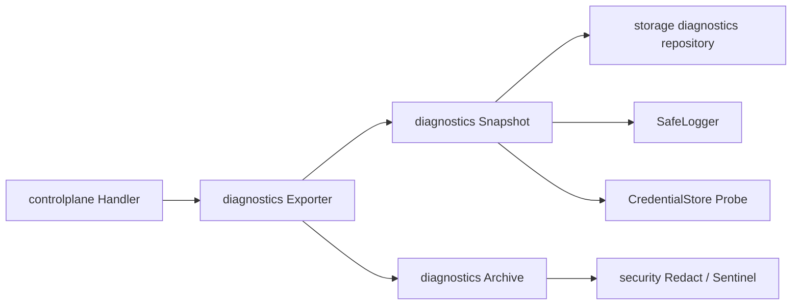

# Aggregation Hub 诊断后端模块边界设计

**日期：** 2026-08-16  
**状态：** 已获方案确认，待用户审阅文档后实施  
**关联范围：** Phase 5 / Task 5.3

## 1. 目标

诊断导出必须在不泄漏凭据、请求正文、Header、完整 URL 或任意用户路径的前提下，提供可测试、可维护的本地故障证据。实现不得把 HTTP、SQLite、CredentialStore、日志、ZIP 和文件系统逻辑堆入同一个模块。

## 2. 模块与接口

```text
internal/
├─ security/
│  └─ redact.go
├─ observability/
│  ├─ logger.go
│  └─ diagnostics/
│     ├─ snapshot.go
│     ├─ archive.go
│     └─ exporter.go
├─ controlplane/
│  ├─ diagnostics_contract.go
│  └─ diagnostics_handler.go
└─ storage/
   └─ diagnostics_repository.go
```

- `security/redact`：纯函数。输入 URL 或文本，输出脱敏值/敏感标记判断；不得访问文件、数据库或 HTTP。
- `observability/logger`：受限字段的最近错误摘要环形缓冲；不得接收正文、Header、Tool 参数或原始错误文本。
- `observability/diagnostics/snapshot`：通过小接口收集运行时、迁移、CredentialStore Probe、Provider 健康和安全错误摘要，输出一个已验证的领域快照。
- `observability/diagnostics/archive`：把已验证快照编码为固定 allowlist ZIP，并执行条目名称与内容 Sentinel 扫描；不得查询数据库或读取用户目录。
- `observability/diagnostics/exporter`：只编排快照、归档和受控落盘；目标接口为 `Summary(ctx)` 与 `Export(ctx)`。
- `controlplane`：只定义安全 HTTP DTO、鉴权后的路由和状态码映射；不得拼 ZIP 或直接查询 SQLite。
- `storage/diagnostics_repository`：仅查询迁移与 Provider 所需摘要；不返回 Base URL、凭据引用、Adapter 配置、数据库路径或原始错误。

## 3. 依赖方向



依赖只向下流动；`security` 不依赖诊断、控制面或存储；`storage` 不依赖 HTTP；`controlplane` 不知道 ZIP 条目细节。

## 4. 不变的公开行为

- `GET /internal/v1/diagnostics` 与 `POST /internal/v1/diagnostics/export` 继续受现有管理令牌保护。
- ZIP 继续只包含固定 allowlist：运行时、迁移、CredentialStore Probe、Provider 健康、安全错误摘要和清单。
- 返回给桌面端的导出结果仅含文件名、大小、时间和格式版本，不含绝对路径。
- `dataDir/diagnostics` 是唯一可写目录；不读取 `.env`、数据库文件、完整日志或任意用户路径。

## 5. 迁移策略与验收

1. 先为 Snapshot、Archive 和 Exporter 的公开接口补齐现有行为测试。
2. 迁出当前混合实现，保持 Control Plane DTO 与路由不变。
3. 由 `main` 仅组装依赖，禁止在其中内联 SQL、Provider 转换或归档逻辑。
4. 删除旧实现后执行 Go 单元、Race、全量门禁和秘密扫描。

验收要求：删除任一模块后，其复杂度不会散落回 Handler 或 `main`；每个模块可通过自己的公开接口使用 Fake 依赖测试。

## 6. 非目标

- 不引入 DI 框架、后台队列或第三方 ZIP/日志库。
- 不改变 Data Plane、Provider 路由、CredentialStore 保存逻辑或数据库既有迁移。
- 不宣称真实 Provider、Claude Code、Codex 或 OAuth 证据。
