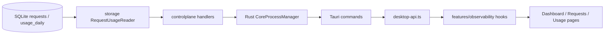

# Task 5.4：请求与用量查询设计

> 状态：已批准的 Phase 5 设计补充；实现前设计基线。
> 日期：2026-08-16
> 范围：Dashboard、请求记录和 Token 用量查询；不含 Provider 健康、备份恢复或原生 Provider 协议适配。

## 1. 背景与目标

Aggregation Hub 已在请求终态时把脱敏请求元数据和 Token 日汇总写入 SQLite。Task 5.4 要把这些已有数据以本地 Control Plane 查询接口和桌面页面呈现出来，让用户无需终端即可查看网关的请求状态、Token 消耗、缓存命中率和输出量。

本任务的成功标准：

1. 用户可以从单独页面查看概览、请求记录和用量趋势。
2. 请求列表支持有界筛选和稳定的游标翻页；详情只展示已持久化的安全元数据。
3. 用量只统计请求数、成功/失败/取消数、输入/输出/缓存写入/推理 Token 与缓存命中率。
4. Token 未报告和真实零值可区分；缓存命中率未知时显示 `—`。
5. Control Plane、Tauri 桥接和 WebView 之间保持分层；WebView 不访问 SQLite、管理令牌或凭据。

## 2. 已确认约束

- 以用户最新明确要求为准：**不做费用、价格或金额计算与展示**。
- 历史 SQLite 表中已有的 `estimated_cost_microusd` 和价格相关表不删除、不迁移、不读取；Task 5.4 的 SQL、DTO、OpenAPI、桌面状态和页面均不得包含成本字段。
- 不保存或返回 Prompt、回复正文、请求 Header、Tool 参数、Authorization、完整上游 URL Query、完整错误体或凭据。
- Data Plane 继续只监听 `127.0.0.1`；本任务只增加已受 Management Token 保护的 Control Plane 读接口。
- 不新增依赖、不引入新的全局状态；沿用现有 `desktop-api.ts` Tauri 调用边界和 feature hook 模式。
- UTC 是唯一聚合时区；UI 使用本地时区格式化显示时间，但查询边界和日汇总键保持 UTC。

## 3. 方案比较与选择

### 方案 A：SQLite 仓储查询 + 固定排序的游标分页（选择）

新增只读 `storage` 查询投影；请求列表始终按照 `created_at DESC, id DESC` 排序，Cursor 编码这两个稳定排序键。Control Plane 只解析 allowlist 筛选条件并调用查询接口。

- 优点：分页在新增请求时不重复、不漏项；SQL 可使用索引；边界明确；实现可测试。
- 代价：V1 不向用户开放任意排序字段；如需新排序，后续需新增 allowlist、Cursor 格式和索引验证。

### 方案 B：offset/limit 分页

- 优点：实现较短。
- 缺点：新请求写入时页码漂移，容易重复或漏项；不适合持续增长的请求记录。

### 方案 C：桌面端先拉取全部记录后筛选和聚合

- 优点：后端接口较少。
- 缺点：不受控的内存和传输开销，WebView 获得过多数据，无法保证 SQLite 查询与 UI 一致。

## 4. 领域边界和模块职责

- `storage`：只负责参数化 SQL、Cursor、行扫描与查询投影；不处理 HTTP 或 UI 文案。
- `controlplane`：只负责鉴权、参数校验、HTTP 状态码和安全 DTO；不直接拼 SQL。
- Rust：只提供强类型的固定 Control Plane 路径和查询参数；不接收任意 URL 或文件路径。
- `desktop-api.ts`：唯一的 WebView `invoke` 边界。
- `features/observability`：页面数据加载、过期响应保护、格式化和查询状态；不放进 `App.tsx`。
- 页面和抽屉：只负责展示、可访问交互和重试，不保存敏感数据。

## 5. 查询契约

### 5.1 请求记录

`GET /internal/v1/requests`

允许的 Query：

| 字段 | 规则 |
|---|---|
| `page_size` | 可选，默认 25，范围 1–100 |
| `cursor` | 可选、不透明 Base64URL Cursor；只允许当前固定排序格式 |
| `status` | 可选，`pending`、`streaming`、`succeeded`、`failed`、`cancelled`、`aborted_by_restart` 之一 |
| `provider_slug` | 可选，非空、最大 128 字符 |
| `public_model_id` | 可选，非空、最大 512 字符 |
| `source_protocol` | 可选，`anthropic_messages`、`openai_responses`、`openai_chat` 之一 |
| `from_utc` / `to_utc` | 可选，严格 UTC RFC3339；最大时间窗 366 天，`from_utc <= to_utc` |

固定排序：`created_at DESC, id DESC`。不支持任意 `sort` 字段；这就是 V1 的排序 allowlist。

响应每项仅包含：请求 ID、创建/完成时间、协议、Provider 快照、公共模型快照、是否流式、状态、HTTP 状态、错误类别、重试标记、首 Token 时间、总耗时，以及分类 Token。**不返回** `client_request_id`、上游模型、Local Key ID、Provider/模型外键、字节数、费用、正文、Header 或 Tool 数据。

`GET /internal/v1/requests/{id}` 使用同一安全投影返回单项；ID 不存在返回安全的 `404` 错误。

### 5.2 用量

`GET /internal/v1/usage/summary` 和 `GET /internal/v1/usage/timeseries` 共享可选 `provider_slug`、`public_model_id`、`from_utc`、`to_utc` 筛选。日期范围按 UTC 日聚合，默认最近 7 个完整 UTC 日，最大 366 天。

汇总字段：

- `request_count`、`succeeded_count`、`failed_count`、`cancelled_count`
- `input_tokens`、`output_tokens`、`cached_input_tokens`、`cache_write_tokens`、`reasoning_tokens`
- 对应的 `*_reported_count`
- `cache_eligible_count`、`cache_hit_count`
- `cache_hit_rate_basis_points`：仅当所有纳入汇总的请求均可比较时为 `0..10000`；否则为 `null`。

趋势响应按 UTC 日期升序返回同一组字段。V1 不计算费用、金额、平均价格或按价格表回放历史成本。

### 5.3 错误与安全

- Query 参数非法、一致性错误或 Cursor 失效返回统一安全错误，不回显原始数据库或 SQL 错误。
- 所有查询使用占位参数，所有动态筛选仅由预定义 SQL 片段构成。
- 请求与用量查询最多执行一个主查询（请求详情一个查询）；不按行调用 Provider/模型仓储，不产生 N+1。

## 6. 数据库与索引

已有表保留不变。若现有索引不足以覆盖快照字段和稳定游标，新增一份**只增加**的迁移：

- `requests(provider_slug_snapshot, created_at DESC, id DESC)`
- `requests(public_model_snapshot, created_at DESC, id DESC)`
- `requests(status, created_at DESC, id DESC)`
- `requests(source_protocol, created_at DESC, id DESC)`
- `requests(created_at DESC, id DESC)`
- `usage_daily(date_utc, provider_slug_snapshot, public_model_snapshot)`（仅在现有主键不能满足查询计划时增加）

实现时必须先用实际 Schema 和 `EXPLAIN QUERY PLAN` 测试确认，不复制冗余索引。不得修改旧 migration，不得执行 reset。

## 7. 桌面信息架构与交互

在现有浅色黑白工具风导航中增加三页，状态继续收在右上角小型状态控件中：

1. **概览**：最近 7 天请求数、输出 Token、缓存命中率、失败数；显示按 UTC 日的紧凑表格作为趋势和图表替代。
2. **请求记录**：紧凑筛选栏、分页表格、状态标记。点击行打开 `RequestDetailDrawer`，用 Escape、关闭按钮和焦点回归关闭。详情明确说明未保存 Prompt、回复和 Tool 参数。
3. **用量**：时间范围、Provider、模型筛选；汇总卡片和逐日表格，未知 Token/缓存命中率显示 `—`。

所有页面必须有 loading、empty、error、success 四态；错误使用固定安全文案，并提供重试按钮。列表行、按钮和卡片沿用现有轻微 hover 位移/阴影风格，不增加渐变或大面积装饰。

## 8. 测试与验收

### 后端

- Cursor 编解码、稳定翻页、筛选边界和非法 Query。
- UTC 时间窗、未知 Token 与真实零 Token、未知缓存命中率。
- DTO 及 JSON 中不存在费用、Body、Header、Tool、上游 URL Query、凭据或原始错误。
- 每个查询路径使用有界、参数化 SQL；测试确认没有按行二次查询。
- migration 与索引存在性/查询计划。

### 桌面

- `desktop-api.ts` 参数类型和 Tauri 调用名称。
- 概览、请求记录、用量页面的 loading、empty、error、success。
- 筛选、翻页、`—` 展示、抽屉关闭和焦点回归。
- 没有在 `App.tsx` 直接调用 `invoke`，没有 URL/Storage 中的敏感筛选值。

### 门禁

先执行变更范围内 Go、Rust、React 测试和 OpenAPI lint，再执行 `pnpm check` 与 `pnpm core:test:race`。只能声明 L1 静态和 Fake 验证；不把真实 Provider、Claude Code、Codex 或 OAuth 表述为已验证。

## 9. 非目标与后续

- 不实现真实 Provider、客户端或 OAuth 联调。
- 不支持费用、价格、账单结算或额度余额。
- 不支持跨设备同步、远程管理或公网监听。
- 不增加原生 Provider 协议 Adapter；按既定优先级，在其余 V1 功能完成后再评估。
